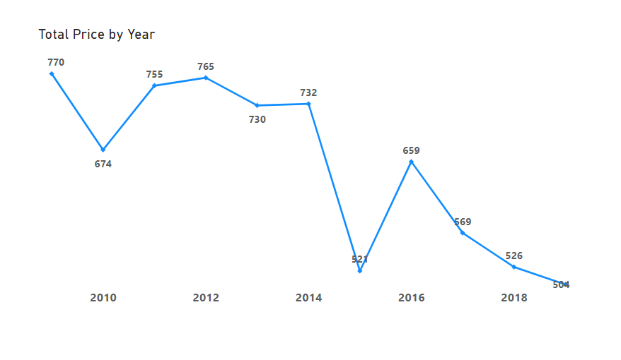
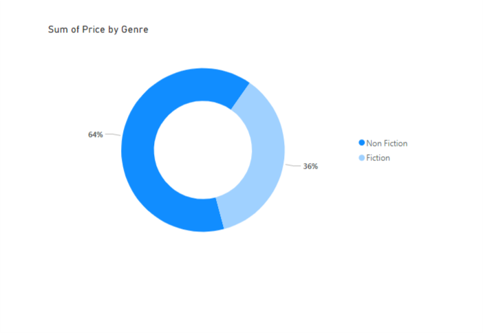
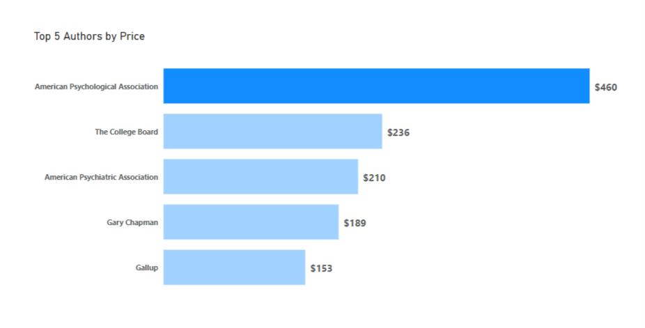
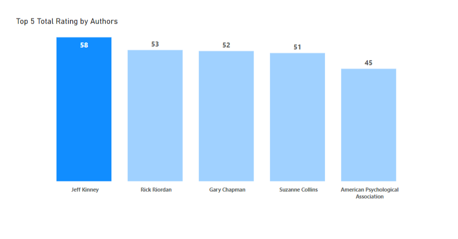

# Bookseller_Store

## INTRODUCTION
This is a Power BI project on bookseller store analysis of an imaginary store called **bookseller store**.
The project is to analysis and derive insights to answer crucial questions and help the store make data driven decisions.
The dataset consists of Five Hundred and Fifty entries with Seven Fields namely:
- Book Name
- Author
- User Rating
- Review
- Prices
- Year
- Genre

----

**_Disclamer_**: _All dataset and report do not represent any company, institution or country, but just a dummy  to demonstrate capability of Power BI._

## PROBLEM STATEMENT
1.	Count of books released by authors?
2.	What is average rating for books released by authors?
3.	 What is total price of books for each year?
4.	How many books released on every year?
5.	Type of books released by author ?

## SKILLS/ CONCEPT DEMONSTRATED

The following Power BI features were incorporated;
- DAX,
- Filter,
- Tooltips,
- Button
- Measures

## VISUALIZATION
The report contains just one page visuals with many tiles that answers many questions.

You can interact with report.[here](https://app.powerbi.com/groups/me/reports/88e6c0da-02c6-4d34-a821-65d53676f772/ReportSectionb98b865cae00232b348b?experience=power-bi)

## ANALYSIS

### PRICE

The total price of books in the store for every year is analysis, the visual shows that that year 2019 had highest sum of price in all the year.

### Genre

The Non Fiction book type has higher percentage of number of books in the store.

### Number of Books by Author

This tile depicts that Jeff Kinney produced highest number of books for these period of years.

###  Author with Price

American Psychological Association has the highest sum of price tags while others like others like The College Board,Gary Chapman,Gallup followed

### Rating

This is to show how users raing the books they bought, the highest rating is 5 stars, Jeff Kinney has highest ratings.

## CONCLUSION 
- There are Five Hundred and Fifty Books of Two Hundred and Forty Fiction and Three hundred and Ten Non Fiction in the store with a worth of $7,205
- Jeff Kinney has highest user rating while, in 2017 the number of Author that released book was the highest with number up to Forty- nine.

## RECOMMENDATION

For a deep dive analytics, the dataset quantity of books sold over the years will be required for comparison and data driven decision.
